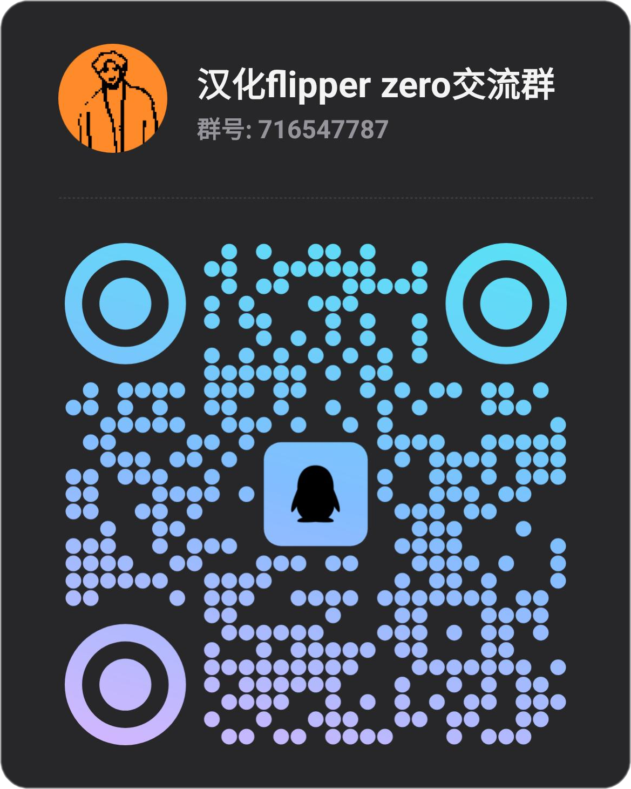
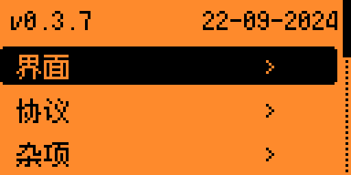
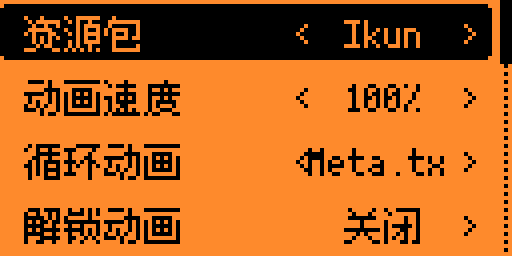
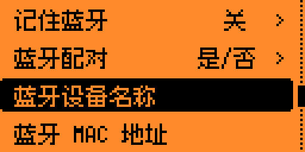

<p align="center">
  <picture>
    <source media="(prefers-color-scheme: dark)" srcset=".github/assets/logo_dark.png">
    <source media="(prefers-color-scheme: light)" srcset=".github/assets/logo_light.png">
    
  </picture>
</p>

<h2 align="center">
  <a href="#安装方法">安装</a> · <a href="#变更列表">功能</a> · <a href="https://discord.gg/momentum">Discord</a> · <a href="#支持">支持</a>
</h2>



本分支基于 [Momentum-Firmware](https://github.com/Next-Flip/Momentum-Firmware) 维护，重点是中文本地化、复刻设备适配和常用资源补充。

- 提供中文固件编译支持
- 主固件内置中文总字库
- 添加更多 Tesla SubGhz 数据
- 添加更多 Sextoy SubGhz 数据
- 添加复刻设备状态开关

当前中文方案已经不是旧版 `CN` / `CN_built-in` 的实现方式。

现在使用的是：

- 编译时从 `localization/zh_CN/strings.json` 和源码中的中文文本生成 `primary_zh`
- 主固件通过 `canvas` 自动切换中文字体绘制非 ASCII 文本
- RAM updater 阶段不链接完整中文字库，避免更新器超过体积限制

详细说明请看：

- [汉化方法](./汉化方法.md)

QQ 交流群：`716547787`

<br>
<h2 align="center" id="变更列表">变更列表</h2>

下面按相对上游 Momentum 原版的明显差异整理，不是完整 diff。

```txt
[相对原版新增]

- 中文固件构建路径：MOMENTUM_UI_LANG=zh_CN
- 中文词条源：localization/zh_CN/strings.json
- 中文总字库生成脚本：scripts/momentum_zh_font_gen.py
- 中文 BDF 字体与 bdfconv 工具：tools/u8g2_cn_tools/
- About 页面 QQ 群与中文信息页
- Clipper / 复刻设备构建配置
- Clipper 专用 U2F 证书资源
- applications/external 外部应用包：244 个 `.fap` 应用，其中 243 个新增 name_zh 中文菜单名
- 更多 Tesla SubGhz 数据
- 更多 Sextoy SubGhz 数据
- 小米等红外码库补充
```

```txt
[相对原版改动]

- 核心 UI、设置、NFC、Sub-GHz、Infrared、iButton、LF RFID、BadUSB 等主要流程补充中文显示
- applications/external 同步 CN 分支，日常扩展应用菜单、页面、提示文案做中文化
- canvas 在中文构建下自动为非 ASCII 文本切换中文字体
- updater 文案中文化，但 RAM updater 不链接完整中文字库
- 应用 manifest 支持 name_zh，菜单可显示中文应用名
- 发布流程改为构建 original / clone / clipper 三套中文固件包
- Release 附带多字体 u8f 包，可手动替换 primary_zh.u8f
- Issue 模板收敛为 UI 文案问题入口
```

```txt
[移除 / 收敛]

- 移除上游通用 build / lint / webhook 工作流，保留当前仓库的发布工作流
- 中文字体不再依赖 asset_packs 字体目录
- 旧 CN / CN_built-in 的直接源码硬改和资源包字体方案不再作为当前主线
```

<br clear="right"/>

该自定义固件基于 [官方固件](https://github.com/flipperdevices/flipperzero-firmware) 开发，并包含 [Unleashed](https://github.com/DarkFlippers/unleashed-firmware) 的大量实用功能。它也是 Xtreme 固件路线的延续版本之一。

<br>
<h2 align="center">操作模式</h2>

本分支的目标是在保留 Momentum 主体体验的前提下，继续维护一套可用、清晰、可同步上游的中文固件方案，同时保留常用增强功能。
<br><br>
- <h4>功能丰富：集成稳定且实用的功能与应用，并保留常见增强能力。</h4>

- <h4>稳定性：中文字体只进入主固件，更新器保持轻量，优先保证可编译、可升级。</h4>

- <h4>可维护性：中文字库生成、显示路径、文档说明都尽量收敛成单一方案，避免继续维护多套旧逻辑。</h4>

<br><br>
以下仅列出一部分明显功能和改动，完整内容仍建议结合上游 Momentum 更新记录一起查看。

<br>
<h2 align="center">Momentum 设置</h2>

我们保留了 Momentum 自带的设置应用，用于配置固件的大部分核心行为：




- <ins><b>界面：</b></ins> 调整桌面动画、主菜单、锁屏、文件浏览器等界面行为。
- <ins><b>协议：</b></ins> 配置 SubGhz 设置，管理自定义频率，扩展 SubGhz 频率范围，并配置外部模块所用 GPIO 引脚。
- <ins><b>杂项：</b></ins> 修改设备名称、XP 等级、屏幕选项，并配置 [RGB 背光](https://github.com/Z3BRO/Flipper-Zero-RGB-Backlight) 等功能。

<br clear="left"/>

<br>
<h2 align="center">动画 / 资源包</h2>

Momentum 仍然保留完整的资源包系统，用于切换动画、图标和主题资源。


你可以自行制作资源包，也可以从社区或网站获取现成资源包。关于资源包格式和制作方式，可参考上游文档中的 [Asset Packs 说明](https://github.com/Next-Flip/Momentum-Firmware/blob/dev/documentation/file_formats/AssetPacks.md)。

<br clear="left"/>

<br>


资源包上传到 Flipper 的 `SD/asset_packs` 目录后，可以在 `Momentum Settings > Interface > Graphics` 中进行选择和切换。

<br clear="left"/>

<br>


需要注意的是，当前中文字体方案已经不再依赖资源包。资源包只负责动画、图标和主题表现，不再承担中文主字库功能。

<br clear="left"/>

<br>
<h2 align="center">Bad 键盘</h2>


BadUSB 本身已经很强，但 Bad-KB 提供了更多 USB 和蓝牙参数配置能力。

在蓝牙模式下，可以伪装显示名称和 MAC 地址，用于更灵活的测试场景。

在 USB 模式下，也可以伪造制造商、产品名，以及 VID/PID 等信息。

<br clear="left"/>

<br>
<h2 align="center" id="安装方法">安装方法</h2>

推荐从本仓库 Release 下载对应设备类型的中文固件包：

<br>

> <details><summary><code>qFlipper 安装包 (.tgz)</code></summary><ul>
>   <li>从 <a href="https://github.com/kalicyh/Momentum-Firmware-CN/releases/latest">本仓库最新发布页面</a> 下载对应设备类型的 <code>.tgz</code> 包</li>
>   <li>确保 <code>WebUpdater</code> 和 <code>lab.flipper.net</code> 已关闭</li>
>   <li>打开 <a href="https://flipperzero.one/update">qFlipper</a> 并连接设备</li>
>   <li>点击 <code>Install from file</code></li>
>   <li>选择下载好的 <code>.tgz</code> 并等待完成</li>
> </ul></details>

> <details><summary><code>压缩包 (.zip)</code></summary><ul>
>   <li>从 <a href="https://github.com/kalicyh/Momentum-Firmware-CN/releases/latest">本仓库最新发布页面</a> 下载对应设备类型的 <code>.zip</code> 包</li>
>   <li>解压后得到新的固件目录</li>
>   <li>打开 <a href="https://flipperzero.one/update">qFlipper</a>，进入 <code>SD/update</code> 并把固件目录放进去</li>
>   <li>在 Flipper 上进入文件菜单，找到更新目录</li>
>   <li>进入目录后运行名为 <code>Update</code> 的文件</li>
> </ul></details>

<br>
<h2 align="center">自行构建</h2>

```bash
下载仓库:
$ git clone --recursive --jobs 8 https://github.com/kalicyh/Momentum-Firmware-CN.git
$ cd Momentum-Firmware-CN/

直接刷写到 Flipper（需要 USB 连接，qFlipper 已关闭）:
$ ./fbt flash_usb_full

编译英文固件:
$ ./fbt COMPACT=1 DEBUG=0

编译中文固件:
$ MOMENTUM_UI_LANG=zh_CN ./fbt COMPACT=1 DEBUG=0

编译英文更新包:
$ ./fbt updater_package

编译中文更新包:
$ MOMENTUM_UI_LANG=zh_CN ./fbt updater_package

编译 Clipper / 复刻设备中文更新包:
$ MOMENTUM_UI_LANG=zh_CN MOMENTUM_DEVICE=clipper ./fbt updater_package
$ MOMENTUM_UI_LANG=zh_CN MOMENTUM_DEVICE=clone ./fbt updater_package

构建并启动单个应用:
$ ./fbt launch APPSRC=your_appid
```

<h2 align="center">Stargazers 随时间变化</h2>

[](https://starchart.cc/kalicyh/Momentum-Firmware-CN)

<h2 align="center" id="支持">支持</h2>

如果你喜欢这套固件，欢迎传播、反馈和补充改进意见。

> **[Ko-fi](https://ko-fi.com/willyjl)**：单次或周期性支持

> **[PayPal](https://paypal.me/willyjl1)**：单次支持

> **BTC**：`1EnCi1HF8Jw6m2dWSUwHLbCRbVBCQSyDKm`

感谢支持。
